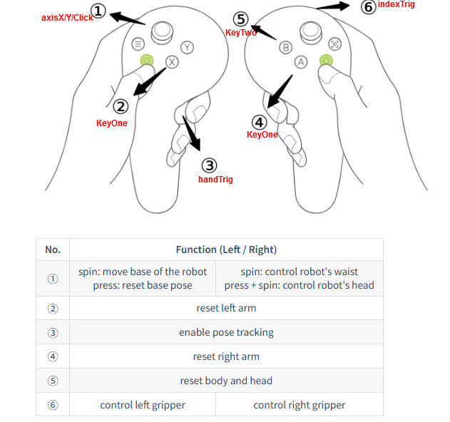

## Install dependencies

```bash
mkcert -install
mkcert -cert-file cert.pem -key-file key.pem 192.168.37.124 localhost 127.0.0.1

cd path/to/vuer
pip install --prefix=~/.local -e  '.[all]'

pip install zmq
```

```bash
colcon build
source install/setup.bash
ros2 run pico_driver monitor

# https://192.168.37.124:8012/?ws=wss://192.168.37.124:8012
```

## Run
```bash
source  ~/src/ros2_ws/install/setup.bash
ros2 run pico_driver monitor
```

## Message
```json
[{"position": {"x": 0, "y": 0, "z": 0}, "rotation": {"w": 0, "x": 3.141592653589793, "y": 0, "z": 0}, "axisClick": "false", "axisX": 0, "axisY": 0, "indexTrig": 0, "handTrig": false, "keyOne": "false", "keyTwo": "false", "ts": 1745830113268}, {"position": {"x": 0, "y": 0, "z": 0}, "rotation": {"w": 0, "x": 3.141592653589793, "y": 0, "z": 0}, "axisClick": "false", "axisX": 0, "axisY": 0, "indexTrig": 0, "handTrig": false, "keyOne": "false", "keyTwo": "false", "ts": 1745830113285}]
```


